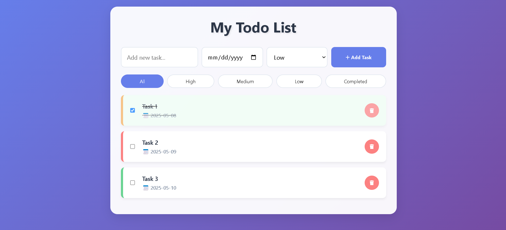

# Todo List Application

## User Interface

Below is a screenshot of the app interface:

## Overview

This Todo List application allows users to manage their tasks efficiently. Users can add new tasks, set due dates, and assign priority levels (low, medium, high) to each task. The application provides filtering options to view tasks based on their priority or completion status.

## Features

- Add new tasks with a title, due date, and priority.
- Mark tasks as completed or delete them.
- Filter tasks by all, high, medium, low, or completed status.
- Responsive design for mobile and desktop views.

## Usage

1. Open the `ToDOList.html` file in a web browser.
2. Use the input fields to add a new task, select a due date, and choose a priority level.
3. Click the "Add Task" button to save the task.
4. Use the filter buttons to view tasks based on your preferences.
5. Click the checkbox next to a task to mark it as completed or the delete button to remove it.

## Technologies Used

- HTML
- CSS
- JavaScript

## License

This project is open-source and available for modification and distribution.
